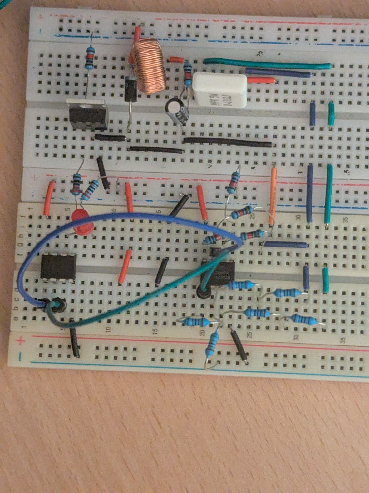
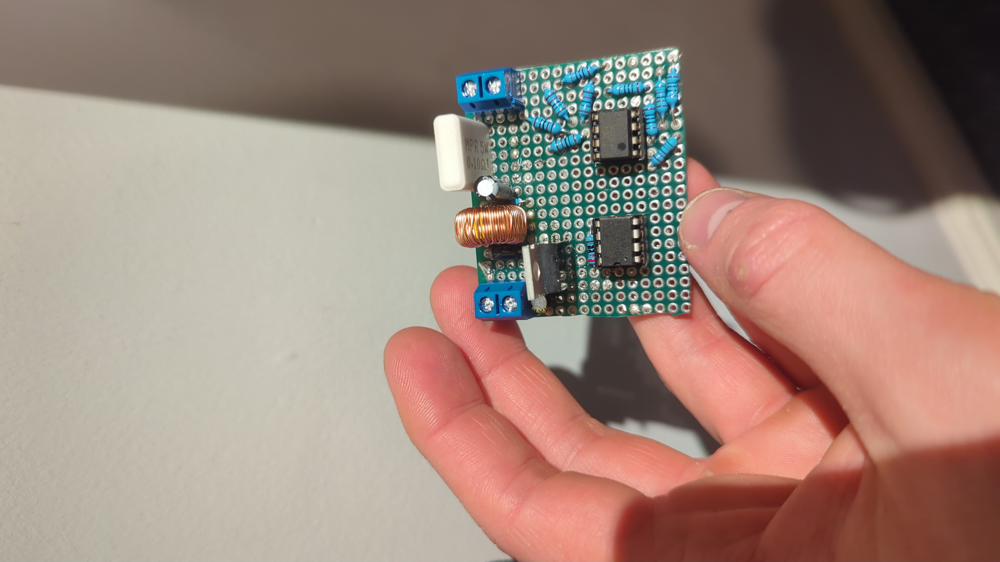
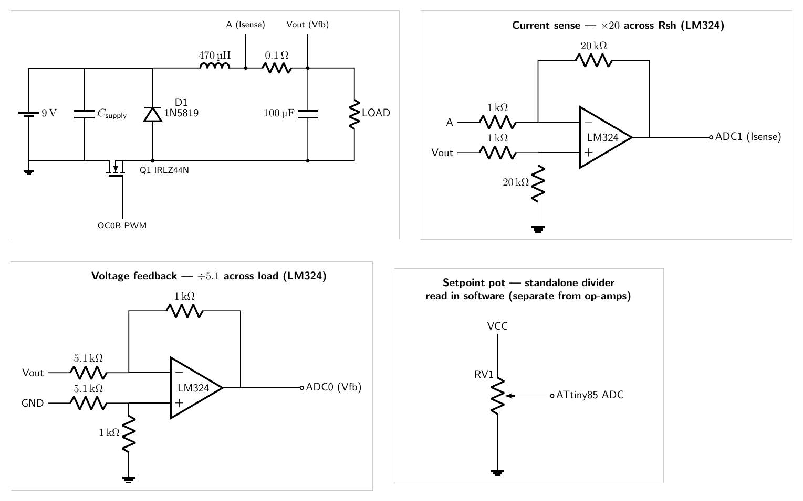

# Bare-metal Buck Converter (ATmega328P)

A closed-loop switching power converter written in bare-metal AVR C — no Arduino
framework. The microcontroller generates a high-frequency PWM drive signal,
samples the output voltage and a shunt-resistor current sense through its ADC,
and adjusts the duty cycle to regulate the output while limiting current.

Three firmware variants are included:

| Folder | Mode | What it does |
|--------|------|--------------|
| `direct-adc-single-channel/` | **Closed loop** | Regulates the output to `TARGET_VOLTAGE` (3.3 V) by trimming the duty cycle up/down from ADC voltage feedback. Trips an over-current flag when the shunt reading exceeds `MAX_CURRENT_MA` (200 mA). |
| `pot-pwm/` | **Open loop / bring-up** | Maps a potentiometer on ADC0 straight to PWM duty (`duty = adc >> 3`). Used to manually sweep duty and characterise the power stage before closing the loop. |
| `atmega328p-dual-channel-display/` | **2 channels + OLED readout** | Two independent regulators on one ATmega328P (Timer0 → OC0B/PD5, Timer2 → OC2B/PD3). Each channel has its own voltage feedback, shunt-current limit, setpoint potentiometer, and over-current flag, plus a per-channel **voltage / current / power** readout on a 128×32 SSD1306 OLED via the bundled [`display-lib/`](display-lib/README.md). |

> **Control-only build:** the display is optional. `main.cpp` guards all OLED code
> behind `-DWITH_DISPLAY`; drop that flag from the Makefile and the same source
> compiles to the control-only firmware (no `display-lib/` link needed).

> **Two hardware builds:** the project went through an **ATtiny85** single-channel
> build and a later **ATmega328P** dual-channel build — see
> [Two builds: ATtiny85 → ATmega328P](#two-builds-attiny85--atmega328p) for how
> they differ.

## Photos

| Breadboard prototype | Soldered protoboard |
|----------------------|---------------------|
|  |  |

> ⚠️ These photos are an **earlier build** and do not show the most up-to-date
> circuit. See [Two builds: ATtiny85 → ATmega328P](#two-builds-attiny85--atmega328p)
> below for what changed between the original single-channel and the dual-channel
> revision.

## Schematic

These are **code-defined** schematics — drawn with [CircuitikZ](https://github.com/circuitikz/circuitikz)
(LaTeX) under [`images/circuitikz/`](images/circuitikz/), so every wire and connection
is explicit in source rather than drawn by hand. Cross-panel connections use named
net labels (`A`, `Vout`, `GND`, `VCC`, the ADC pins): a label of the same name is
the same electrical node.

### Final schematic

The four panels — power stage, ×20 current-sense diff amp, ÷5.1 voltage-feedback
diff amp, and the standalone setpoint pot:



Individual vector panels: [power stage](images/schematic-power.svg) ·
[current sense](images/schematic-current.svg) ·
[voltage feedback](images/schematic-voltage.svg) ·
[setpoint pot](images/schematic-pot.svg)

> Regenerate with: `images/circuitikz/build.sh` (needs `pdflatex` with the
> `circuitikz` package, `pdftocairo` from poppler, and ImageMagick).

## Hardware

Both builds share the **same analog design** — the buck power stage, the two LM324
difference amplifiers, the shunt and the setpoint pot are identical. What changed
between them is the **microcontroller** and what it had the I/O to drive.

### Two builds: ATtiny85 → ATmega328P

| | **ATtiny85** — original single-channel | **ATmega328P** — dual-channel revision |
|---|---|---|
| Package | 8-pin DIP | 28-pin DIP |
| Clock | internal RC oscillator (no crystal) | external crystal / oscillator |
| Output channels | **1** | **2** independent |
| PWM gate drive | Timer0 `OC0B` (PB1) | Timer0 `OC0B`/PD5 **+** Timer2 `OC2B`/PD3 |
| Switching | Fast PWM, `TOP = 127`, ~62.5 kHz | same, per channel |
| Voltage feedback | ÷5.1 LM324 diff amp → ADC | one per channel |
| Current sense | ×20 LM324 diff amp across the 0.1 Ω shunt → ADC | one per channel |
| Setpoint | 1 potentiometer → ADC | 1 potentiometer **per channel** |
| Catch diodes | one | more (one per channel) |
| Readout / display | none | 128×32 SSD1306 **per channel** (V / I / P) |
| Supply | 9 V battery | 9 V battery |
| Programmer | ArduinoISP (STK500v1, 19200 baud) | same |
| Firmware here | `direct-adc-single-channel/`, `pot-pwm/` | `atmega328p-dual-channel-display/` |

> The firmware in this repo is written against the **ATmega328P** register set. The
> ATtiny85 column above is the **original hardware** mapping (see its pin map below);
> the control logic is the same idea on both chips.

### Shared analog design

- **Programmer:** custom-built ISP — an **Arduino module running ArduinoISP** (STK500v1 protocol) on `/dev/ttyUSB0` @ 19200 baud, flashed with AVRDUDE. The MCU is a bare chip programmed in-circuit over SPI (MOSI/MISO/SCK/RESET), no Arduino bootloader or framework.
- **Power stage:** diode (asynchronous) buck — IRLZ44N MOSFET switch, 470 µH inductor, 1N5819 catch diode, 100 µF output cap.
- **Current sense:** a **0.1 Ω shunt in series in the output line** (between the inductor and the load), read by a **differential amplifier** across it. Matched resistors (**10 kΩ / 1 kΩ**) give a gain of **~20×**, so it amplifies the tiny shunt drop *up* into ADC range. (A diff amp is required here because the shunt is high-side — neither end sits at ground.)
- **Voltage feedback:** a **differential amplifier** (op-amp subtractor) connected **across the load**. Matched resistors (**5.1 kΩ / 1 kΩ**) give a gain of `1/5.1`, so it takes the difference across the output and **attenuates it ~5.1×** down into the ADC range. (Not a passive divider — it rejects common-mode and reads the true load voltage.)
- **ADC reference:** Vcc / AVcc (`REFS0` on the ATmega), so 1023 counts = 5.0 V.

### Bill of materials

| Ref | Part | Value / type | Role |
|-----|------|--------------|------|
| Q1 | **IRLZ44N** | logic-level N-channel MOSFET | Main switch — gate driven **directly** from PD5 (no gate-driver IC) |
| D1 | **1N5819** | Schottky diode | Catch / freewheel diode |
| L1 | Power inductor | ~**470 µH**, high current rating | Buck energy-storage inductor |
| C1 | Capacitor | **100 µF** | Output smoothing |
| C2 | Capacitor | **0.1 µF** | Decoupling on RESET → GND, holds RESET stable (not floating) |
| C3 | Capacitor | **bulk/decoupling** | Across battery V+ / GND to stabilise the supply rail |
| Rsh | Power resistor | **0.1 Ω** | Current-sense shunt, **in series in the output line** between the inductor and the load (high-side) |
| U1 | **LM324** | quad op-amp | Two differential amplifiers: (a) **×20** across the shunt → ADC1 (current; fit `y = 2.11415x + 0.235514`); (b) **÷5.1** across the load → ADC0 (voltage) |
| Ri | Resistors | **10 kΩ × 2, 1 kΩ × 2** | Set the current-sense diff-amp gain **~20×** (amplifies the shunt drop into ADC range → ADC1) |
| Rfb | Resistors | **5.1 kΩ × 2, 1 kΩ × 2** | Set the voltage diff-amp ratio `1/5.1` (attenuates the load voltage ~5.1× into ADC range → ADC0) |
| RV1 | Potentiometer | — | Setpoint input, wired as a **standalone voltage divider**: outer pins to **VCC and GND**, **wiper (middle pin) to its own MCU ADC pin**. Read in software — completely separate from the op-amp circuits, shares no node with either differential amp. |
| — | Battery | **9 V** | Input supply |

## Pin maps

The **ATmega328P** mappings the firmware in this repo targets — single-channel and
dual-channel — followed by the **ATtiny85** mapping of the original single-channel
hardware.

### ATmega328P — single-channel firmware (`direct-adc-single-channel/`, `pot-pwm/`)

| ATmega328P pin | Arduino | Direction | Function |
|----------------|---------|-----------|----------|
| **PD5 / OC0B** | D5 | Output | Fast-PWM gate drive to the MOSFET switch |
| **PC0 / ADC0** | A0 | Input (analog) | Output **voltage feedback** — from a **differential amplifier** across the load (÷5.1, 5.1 kΩ/1 kΩ). In `pot-pwm` this is the potentiometer wiper instead. |
| **PC1 / ADC1** | A1 | Input (analog) | **Shunt current** feedback (op-amp output) |
| **PB1** | D9 | Output | Over-current / status flag (drives high when current exceeds the limit) |

### ATmega328P — dual-channel firmware (`atmega328p-dual-channel-display/`)

Two independent regulators on one chip — Timer0 drives channel 1, Timer2 drives
channel 2, each with its own voltage/current/pot ADC channels and over-current flag.

| Signal | Direction | Channel 1 (Timer0) | Channel 2 (Timer2) |
|--------|-----------|--------------------|--------------------|
| PWM gate drive | Output | **OC0B / PD5** (D5) | **OC2B / PD3** (D3) |
| Voltage feedback | Input (analog) | **ADC0 / PC0** (A0) | **ADC3 / PC3** (A3) |
| Shunt current | Input (analog) | **ADC1 / PC1** (A1) | **ADC4 / PC4** (A4) |
| Setpoint pot | Input (analog) | **ADC2 / PC2** (A2) | **ADC5 / PC5** (A5) |
| Over-current flag | Output | **PB0** (D8) | **PB1** (D9) |

> **Display (`-DWITH_DISPLAY`):** the 128×32 SSD1306 OLED runs on I²C — **SDA = PC4/A4**,
> **SCL = PC5/A5**. Those pins are shared with channel 2's current/pot ADC inputs
> (ADC4/ADC5) in the default map, so on real hardware put the OLED on the TWI pins
> and move that channel's feedback to the remaining ADC channels. See the pin/channel
> map comment at the top of `atmega328p-dual-channel-display/main.cpp`.

### ATtiny85 — original single-channel hardware

The ATtiny85's Timer0 has the same `OC0B` Fast-PWM output, so the gate drive maps
cleanly; the four analog signals land on its ADC channels and the RESET pin keeps
its decoupling cap.

| ATtiny85 pin | Port / function | Direction | Role |
|--------------|-----------------|-----------|------|
| 6 | **PB1 / OC0B** | Output | Fast-PWM gate drive to the MOSFET |
| 7 | **PB2 / ADC1** | Input (analog) | Output **voltage feedback** (÷5.1 diff amp) |
| 3 | **PB4 / ADC2** | Input (analog) | **Shunt current** feedback (×20 diff amp) |
| 2 | **PB3 / ADC3** | Input (analog) | Setpoint **potentiometer** wiper |
| 5 | **PB0** | Output | Over-current / status flag |
| 1 | **PB5 / RESET** | — | Held by the 0.1 µF decoupling cap (not floating) |
| 8 / 4 | **VCC / GND** | — | Supply rails (bulk/decoupling cap across them) |

### PWM timing

Timer0 in Fast PWM mode, `TOP = OCR0A = 127`, **no prescaler**:

```
f_pwm = F_CPU / (OCR0A + 1) = 8 MHz / 128 ≈ 62.5 kHz
```

Duty is set by `OCR0B` (0–127). PWM is output non-inverting on OC0B (PD5).

### Current sense calibration

The shunt + op-amp chain was characterised with a linear fit of op-amp output
voltage vs. measured current:

```
y = 2.11415·x + 0.235514     (x = current in A, y = op-amp output in V)
```

This converts a target current limit into an ADC threshold (`max_shunt_adc`)
that the firmware compares against each loop.

## Circuit setup

Asynchronous (diode) buck. The ATmega328P switches the IRLZ44N at ~62.5 kHz
straight from PD5, the LC filter smooths the output, and the 0.1 Ω shunt + LM324
feed current back to the ADC.

```
        9V ─────┬──────────────┐
       battery  │           Q1 (IRLZ44N)
                │           ┌───┴───┐
   PD5 ──►──────│───────────┤ gate  │  drain
  (OC0B)        │           │       ├───┬───[ L1 470µH ]───┬──[ Rsh 0.1Ω ]──┬──── Vout
  62.5 kHz      │           └───┬───┘   │                  │                 │
                │             source    │                  │             ┌───┴───┐
                │               │      ─┴─ D1 (1N5819)    C1 100µF       │ load  │
                │               │       ▲ catch diode      │             └───┬───┘
                │              GND      GND                GND               GND
                │                       ▲                  ▲
                │      ×20 diff amp across Rsh    ÷5.1 diff amp across load
                │        (LM324, 10k/1k)            (LM324, 5.1k/1k)
                │               │                          │
              PC1 ◄─────────────┘                          └──► PC0
             (ADC1, current)                          (ADC0, Vout feedback)

   PB1 (D9) ──► over-current flag (high when shunt current > limit)
```

> The `pot-pwm` variant replaces the Vout differential amp on ADC0 with the **potentiometer (RV1)**
> to set duty by hand.

Control loop (`direct-adc-single-channel`):

1. Read ADC0 → if Vout below target, `duty++`; if above, `duty--`.
2. Read ADC1 (shunt via LM324) → if current above `MAX_CURRENT_MA`, set PB1 high.
3. Repeat.

## Design notes & rationale

### Why `TOP` sets the switching frequency (and why lower = more stable)

In Fast PWM the switching frequency is:

```
f_pwm = F_CPU / (N · (1 + TOP))      N = prescaler = 1
      = 8 MHz / (1 + 127) ≈ 62.5 kHz
```

**Lowering `TOP` raises the switching frequency.** A higher switching frequency
means the LC filter (L1 + C1) is charged/discharged in smaller, more frequent
increments, so the **output ripple shrinks and the regulated voltage is more
stable**. The trade-off is resolution: `TOP` is also the number of duty steps, so
a smaller `TOP` gives coarser duty-cycle control (e.g. `TOP = 127` → 128 steps).
`TOP = 127` was chosen as the balance — fast enough for a stable output, still
enough duty resolution to regulate smoothly.

### Why each component is there

| Part | Why it was used |
|------|-----------------|
| **0.1 Ω shunt** | Current sense, **in series in the output line** between the inductor and the load. Small enough to waste little power / drop little voltage, large enough to give a measurable sense voltage (0.1 Ω × 0.2 A = 20 mV). Because it sits high-side (neither end at ground), it is read **differentially**. |
| **LM324 op-amp** | A quad op-amp providing **two difference amplifiers**: one **×20** across the shunt (the 20 mV drop is far too small for the ADC, so it is amplified up — the fit `y = 2.11415x + 0.235514` maps the output back to actual current), and one **÷5.1** across the load for voltage feedback. The spare channels also serve the second converter channel. |
| **Differential amplifier (Vout feedback)** | An op-amp subtractor wired **across the load**, with matched 5.1 kΩ/1 kΩ resistors giving gain `1/5.1`. It takes the difference between the two output nodes and attenuates it ~5.1× down below the 5 V ADC reference, so ADC0 sees a scaled copy of the true load voltage. Chosen over a plain resistor divider because it rejects common-mode and measures *across* the load rather than to ground. |
| **IRLZ44N MOSFET** | A **logic-level** N-channel FET — its gate turns on from the 5 V logic pin, which is why it can be driven directly by PD5 with no gate-driver IC. |
| **1N5819 Schottky** | Freewheel/catch diode. Low forward voltage and fast recovery keep switching losses down at 62.5 kHz. |
| **470 µH inductor** | Energy-storage element of the buck — high current rating so it doesn't saturate. |
| **100 µF capacitor** | Output smoothing; works with the inductor to filter the switching ripple. |
| **Potentiometer** | Sets the target output voltage (setpoint) the control loop regulates to. Wired as a **standalone voltage divider** — outer pins across **VCC and GND**, **wiper to a dedicated ATmega328P ADC pin** — and read directly in firmware (ADC-controlled). It does **not** connect to the op-amps or share any node with the differential amps; the MCU reads the wiper and drives the PWM duty to regulate the output to that setpoint. |
| **9 V battery** | Input supply. |

### Pin mapping is fixed on the ATmega328P

On the ATmega328P each timer's compare output is hard-wired to a specific pin —
you can't pick an arbitrary one. `OC0A` is **always** PD6, `OC0B` is **always**
PD5, `OC2B` is **always** PD3, and so on. The compare-output-mode bits come in
matching pairs: **`COM0A1:0` configures `OC0A` (PD6)** and **`COM0B1:0` configures
`OC0B` (PD5)**. So you must set the bits for the pin you actually routed the gate
drive to. This firmware drives the gate from **OC0B (PD5)**, so it configures the
**`COM0B`** bits; the dual-channel build drives channel 2 from **OC2B (PD3)** and
configures **`COM2B`**.

### Non-inverting vs inverting PWM (COM bits `10` vs `11`)

In Fast PWM the two useful compare-output modes are:

| `COMxB1:0` | Mode | Behaviour |
|------------|------|-----------|
| `10` | **Non-inverting** | Pin set **high at BOTTOM**, cleared on compare match → ON-time **grows** with `OCRxB` |
| `11` | **Inverting** | Pin cleared **low at BOTTOM**, set on compare match → ON-time **shrinks** with `OCRxB` (the complement) |

**Why `11` is inverting / when you'd want it:** it's about matching the polarity
of whatever the pin drives. If the gate drive is **active-low** — an inverting
gate-driver IC, or a high-side **P-channel** switch that turns *on* when pulled
low — inverting mode makes "larger `OCRxB` → more switch ON-time" intuitive again
instead of backwards, and it cleanly reaches full-on / full-off at the extremes.
Here the IRLZ44N is driven **directly and active-high** (5 V on the gate = ON), so
**non-inverting (`10`) is the correct choice** and is what the firmware uses.

## Build & flash

Each variant has its own `Makefile`. From inside a variant folder:

```bash
make          # compile main.c → main.elf → main.hex
make flash    # avrdude flash over STK500v1 on /dev/ttyUSB0
make clean    # remove build artifacts
```

Edit `MCU`, `F_CPU`, `PORT`, and `BAUD` at the top of the `Makefile` to match
your setup.

## Display library

The per-channel readout is drawn with a from-scratch, bare-metal SSD1306 graphics
library bundled in [`display-lib/`](display-lib/README.md). Its defining trick is
that it draws shapes **without a full framebuffer** — instead of the 1024 bytes an
SSD1306 framebuffer needs, it stores a short list of draw commands and rasterizes
the screen one 8×8 tile at a time through a single shared 8-byte scratch block.

Text is rendered through the canvas API:

```cpp
c_canvas canvas;
canvas.clear();
pos_t p; p.x = 0; p.y = 0;
canvas.draw.text(p, "1 V3.30 I120 P396");
canvas.update();   // rasterize + flush only the touched tiles
```

See **[`display-lib/README.md`](display-lib/README.md)** for the full design,
API, and the host-side viewer. The driver example (`display-lib/main.cpp`) is
kept alongside the library.
